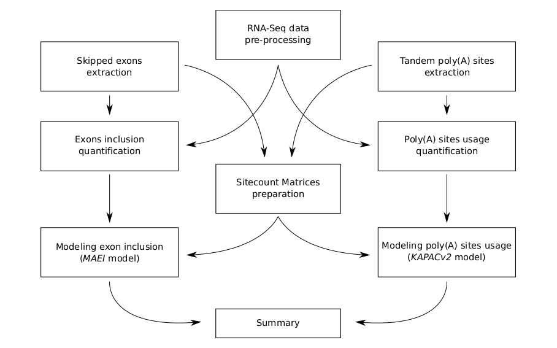

[](https://github.com/gruber-sciencelab/mapp/actions?query=workflow%3Aintegration)
[](https://github.com/psf/black)
[](https://github.com/r-lib/styler)
[](https://www.apache.org/licenses/LICENSE-2.0)
[](https://www.biorxiv.org/content/10.1101/2022.01.09.475576)

# MAPP (Motif Activity on Pre-mRNA Processing)

MAPP is a computational method which enables identification of binding motifs for RNA-binding proteins that shape pre-mRNA processing under specific conditions. It uncovers the most plausible regulators of transcripts' poly(A) sites usage as well as differential cassette exon inclusion as inferred from RNA-Seq data.

## Table of Contents

1. [General information](#general-information)
2. [Installation instructions](#installation-instructions)
3. [Execution test](#execution-test)
4. [Workflow execution](#workflow-execution)
5. [Appendix A: Download and installation of Miniconda3 and Mamba](#appendix-a-download-and-installation-of-miniconda3-and-mamba)

## General information

Maturation of eukaryotic pre-mRNAs via splicing as well as 3’ end cleavage and polyadenylation is modulated across cell types and conditions by a variety of RNA-binding proteins (RBPs). Both processes increase the variability of the transcriptome, as alternative splicing and alternative polyadenylation are crucial mechanisms for regulation of gene expression. Despite a significant number of proteins being associated with RNAs in human cells, their binding motifs as well as their functional impact is not fully understood. To investigate the beforementioned we have developed MAPP (Motif Activity on Pre-mRNA Processing), a fully automated computational workflow to analyze RNA-Sequencing data.

<div align="center">

</div>

> _**Inferring the regulatory sequence motifs and their positional impact on splicing and 3’ end processing using MAPP.** (a) Sketch illustrating how regulators (Reg) bind pre-mRNAs to influence the usage of splice sites (SS) and / or poly(A) sites (PAS). (b) RNA-sequencing (RNA-seq) libraries are available or can be created for most cellular systems of interest. (c) MAPP is an automated tool for analyzing the splicing and 3’ end processing patterns inferred from RNA-seq data with the MAEI (Motif Activity on Exon Inclusion) and KAPACv2 (K-mer Analysis of Poly(A) site Choice) models, respectively. (d) MAPP infers regulatory motifs for RBPs and reports detailed maps of their position-dependent impact on cassette exon inclusion and poly(A) site usage, respectively._

MAPP is implemented as a modular bioinformatics pipeline assembled in the [Snakemake] workflow management system. Functionally speaking, out tool is a composition of nine separate computational pipelines, each of which is dedicated to a different purpose (as presented in the scheme below) and can be executed fully on its own. In a structural sense a union of these nine modules generates an extensive dependency graph between subsequent Snakemake rules. To execute MAPP essentailly means to run all its sub-pipelines in a consecutive manner on a given dataset. Directed Acyclic Graph (DAG) representation of the whole workflow is additionally available [here](images/rulegraph.png).

<div align="center">

</div>

## Installation instructions

Snakemake is a workflow management system that helps to create and execute data processing pipelines. It requires Python 3 and can be most easily installed via the _bioconda_ channel from the anaconda cloud service. In order to simplify the installation process for the users we have prepared a recipe for a [Conda](https://docs.conda.io/en/latest/) environment which contains all the software necessary to execute our workflow. To resolve dependencies efficiently MAPP additionally requires [Mamba](https://github.com/mamba-org/mamba) package manager. As such, these two should be considered as strict requirements. For instructions on how to install Conda and Mamba please see [Appendix A](#appendix-a-download-and-installation-of-miniconda3-and-mamba).

MAPP installation is therefore automatised and limitted to downloading the following repository (also possible with `git clone` command, provided Git version control system is available), navigating to the MAPP directory and running a shell script which will build the environment for the workflow. This may be achieved by the following command: `bash scripts/create-conda-environment.sh`

We have also prepared a minimal dataset in order to test the correct execution of MAPP on a local machine (more information below).

**Currently MAPP supports machines with a Linux operating system.**

## Execution test
In order to facilitate testing MAPP we have prepared [a small test set of input data](https://doi.org/10.5281/zenodo.5566676) as well as a bash script which will download it and handle all of the below-described analysis setup automatically. The script will also trigger the workflow on the local machine with per-rule conda environments mechanism in place. The whole analysis should take below 48h to finish. To execute this test run you will need to navigate to the directory into which you have cloned our repository and type:

```bash
bash scripts/download-and-run-on-example-data.sh
```

Additionally, in order to speed up the test, this workflow run may be parallelized by providing a higher number of cores available for the pipeline, ex:

```bash
bash scripts/download-and-run-on-example-data.sh --cores 8
```

## Workflow execution

All the following steps should be executed inside previously prepared Conda environment. Please activate it with:

```bash
conda activate mapp
```

### Step 1. Download the resources

In order to run MAPP the user needs to provide general genomic information. The following are not part of a particular dataset and should be perceived as shared resources.

#### 1A: Genome sequence and GTF-formatted annotation

MAPP requires species-specific genomic sequence and genomic annotation (in FASTA and GTF formats, respectively) that come from ENSEMBL servers and match the RNA-Seq data that will be analyzed. This repository contains a small bash script which may aid in the process of downloading these data for *Homo sapiens*:

```bash
bash scripts/download-ENSEMBL-resources.sh \
  --species hsa \
  --output-directory resources_ENSEMBL_hsa
```
  
For users who already have these genomic data this step is not necessary.

#### 1B: Altas of PolyA-sites

MAPP requires that the user provides a BED-formatted list of representative PolyA sites. We include a small bash script that will automatically download the resource from our own curated [atlas] and re-format it according to further specifications.

```bash
bash scripts/download-polyA-atlas.sh \
  --species hsa \
  --output-directory ATLAS2_hsa
```

MAPP expects a BED-formatted list where the 5th column represents the number of protocols which support a given PolyA site and the _name_ column encodes the exact coordinate of the representative site, as in the example below:

| chrom | start | end | name | score | strand
|---|-------|-------|-----------|---|---|
| 1 | 16442 | 16452 | 1:16450:- | 4 | - |

For users who already have these data this step is not necessary.

### Optional: Download and parse PWMs from ATtRACT database
If the user wishes to run MAPP in the PWM mode then one of the required parameters for the pipeline is a path to a directory with Position Weight Matrices in TRANSFAC format. We provide a set of commands to download the [ATtRACT] database of known RBPs' binding motifs, parse them and automatically select a subset of high-quality PWMs.


```bash
bash scripts/download-and-parse-ATtRACT-motifs.sh --output-directory ATtRACT_hsa_clean
```

### Step 2. Prepare a table with RNA-Seq samples information

RNA-Seq samples-related information should provided into the pipeline in a form of a TSV "design table" of the format as below:

<div align="center">

| sample | fq1 | fq2 | condition | adapter1 | adapter2 | library |
|-----------|---|---|---|---|---|---|
| Sample A  |   |   |   |   |   |   |
| Sample B  |   |   |   |   |   |   |

</div>

* Please to not use special characters in the samples' IDs nor condition columns: . | whitespaces
* Please always provide paths to the forward reads in the _fq1_ column and reverse reads in _fq2_ column. This holds for single-end sequencing data to, in case of reads originating only from the reverse strand please leave _fq1_ empty.
* _adapter1_ refers to reads in _fq1_, _adapter2_ refers to reads in _fq2_.
* _library_ column may be specified as "stranded" or "unstranded".

### Step 3. Set up the config.yaml file

All the input paths and parameters' values for this Snakemake pipeline are specified in configuration file: `config.yml`. However, because MAPP is a rather complex workflow that consits of separate modules the configuration file has to be generated automatically, based on a configuration template file: `config_template.yml`. It is this file that needs to be adapted by the user manually. Once it has been filled appropriately, a pipeline config file can be created on its base by running a python script:

```bash
python scripts/create-main-config-file.py \
  --config-template configs/config_template.yml \
  --pipeline-configfile configs/config.yml
```

### Step 4. Run the pipeline

There are several ways to start the pipeline, depending on the following options:
* local run vs. cluster support. The former initiates the workflow on a local machine. We recommend at least 16 cores and 100GB of RAM available for such analyses. The latter submits each Snakemake rule as a separate job to a computational cluster. In that way there is little to none workload on the local machine. We have tested MAPP on a SLURM-managed cluster.
* Conda environments vs. Singularity containers. Technology which should be utilized to ensure reproducibility of the analyses. The former selection is tied to building a dedicated Conda environment for each Snakemake rule in the workflow. The latter implies pulling Docker images from online servers and converting them to [Singularity] images - all rules will be executed within. This option requires *Singularity* to be installed on the local machine (and the cluster, if specified).

All of these options are encapsulated in distinct [Snakemake profiles](https://github.com/Snakemake-Profiles/doc). Users who would like to execute MAPP on computational clusters with a queuing engine different than SLURM are encouraged to build their own profiles, give us a feedback and we would happily include new configuration settings into this repository!

In order to execute MAPP please run the master script with proper flags, as presented below:

```
This is the main script to call the MAPP workflow.
Available options:

  -c/--configfile {XXX} (REQUIRED)
  Path to the snakemake config file.

  -e/--environment {local/slurm} (REQUIRED)
  Environment to execute the workflow in:
  * local = execution on the local machine.
  * slurm = slurm cluster support.

  -t/--technology {conda/singularity} (REQUIRED)
  Technology for reproducible research:
  * conda = use conda environments throughout the workflow
  * singularity = use singularity containers throughout the workflow

  -b/--bind {XXX,YYY} (OPTIONAL)
  For workflow execution in a cluster env. with singularity tech:
  additional ABSOLUTE paths that need to be accessible from the containers.
  ($HOME directory is mounted by default)

  -g/--graph {rulegraph/dag} {XXX} (OPTIONAL)
  Do not call the execution.
  Instead - generate Snakemake graps of the workflow in XXX file (SVG).
  * rulegraph = create a rule graph
  * dag = create a directed acyclic graph

  -r/--report {XXX} (OPTIONAL)
  Do not call the execution.
  Instead - generate Snakemake report afer the workflow run (HTML).

  -n/--cores {XXX} (OPTIONAL)
  Number of local cores provided to the workflow.
  (Default: 1)
```

Examples:
```
# create a DAG of the workflow in a file: DAG.svg
bash execution/run.sh \
  -c configs/config.yml \
  -e local \
  -t conda \
  -g dag DAG.svg

# run MAPP on a SLURM-managed cluster with Conda technology with 64 cores
bash execution/run.sh \
  -c configs/config.yml \
  -e slurm \
  -t conda \
  -n 64

# run MAPP locally with Singularity technology with one core
bash execution/run.sh \
  -c configs/config.yml \
  -e local \
  -t singularity \
  -b /absolute/path/to/my/directory
```

### Additional notes

* The most important output of the whole workflow will be collected and summarized in a compressed directory: `summary.tar.gz` located inside the MAPP directory. All results are available in per-module output directories: `modules/*/output`. These folders also contain corresponding logs: both cluster submission info as well as per-job standard output and error streams. Logs of top-level snakemake rules will be stored under `logs` upon succesfull finish of the workflow.
* In case the user would like to provide a custom set of PWMs - please do not use "|" character in the motifs' names. It is reserved.
* Please note that in case Miniconda is not installed in the default `$HOME` directory of the user the path in `jobscript.sh` file for each of the Snakemake profiles might need to be modified.
* In case of analysing very big datasets default resources specified in cluster configuration files (for example: `configs/slurm-config.json`) might need to be adjusted.

## Appendix A: Download and installation of Miniconda3 and Mamba

To install the latest version of [miniconda] on a Linux systems please execute:  

```bash
wget https://repo.continuum.io/miniconda/Miniconda3-latest-Linux-x86_64.sh
bash Miniconda3-latest-Linux-x86_64.sh
source .bashrc
```

In addition, in order to execute workflows based on most-recent Snakemake versions it is **essential** to install Mamba alongside Conda.
Mamba is basically Conda rewritten in _C++_ and it became the default front-end package manager utilized in Snakemake.
For more information please visit [this page](https://www.biostars.org/p/9461665/).

Mamba **has to** be installed in the `base` environment with:
```bash
conda install -n base -c conda-forge mamba
```


[Snakemake]: https://snakemake.readthedocs.io/en/stable/
[miniconda]: https://docs.conda.io/en/latest/miniconda.html
[Mamba]: https://github.com/mamba-org/mamba
[atlas]: https://polyasite.unibas.ch/atlas
[ATtRACT]: https://attract.cnic.es/index
[DockerHub]: https://hub.docker.com/
[Singularity]: https://singularity.lbl.gov/
