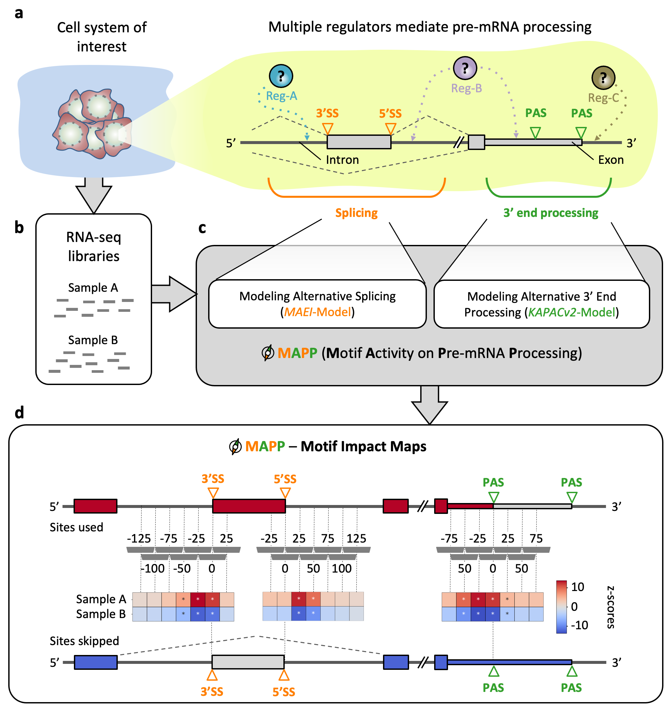

[](https://github.com/gruber-sciencelab/mapp/actions?query=workflow%3Aintegration)
[](https://github.com/psf/black)
[](https://github.com/r-lib/styler)
[](https://www.apache.org/licenses/LICENSE-2.0)
[](https://www.biorxiv.org/content/10.1101/2022.01.09.475576)

# MAPP (Motif Activity on Pre-mRNA Processing)

MAPP is a computational method which enables identification of binding motifs for RNA-binding proteins (RBPs) that shape pre-mRNA processing under specific conditions, including physiological and pathological cellular states. It uncovers the most plausible regulators of transcripts' poly(A) sites usage as well as differential cassette exon inclusion as inferred from RNA-Seq data.

## Table of Contents

1. [General information](#general-information)
2. [Installation instructions](#installation-instructions)
3. [Demo: Instructions for testing MAPP based on demo data](#demo-instructions-for-testing-mapp-based-on-demo-data)
4. [Instructions for running MAPP on user-specified RNA-seq samples](#instructions-for-running-mapp-on-user-specified-rna-seq-samples)

## General information

Maturation of eukaryotic precursor messenger RNAs (pre-mRNAs) via splicing, 3’ end cleavage and polyadenylation is modulated across cell types and conditions by a variety of RNA-binding proteins (RBPs). Both processes increase the variability of the transcriptome. Despite a significant number of proteins being associated with RNAs in human cells, their binding motifs as well as their functional impact is not fully understood. To characterize the impact of RBPs on splicing and/or polyadenylation (poly(A)) we have developed MAPP (Motif Activity on Pre-mRNA Processing), a fully automated computational tool. MAPP enables the inference of the RBP sequence motif-guided regulation of pre-mRNA processing from standard RNA sequencing (RNA-seq) data.

<div align="center">

</div>

> _**Inferring the regulatory sequence motifs and their positional impact on splicing and 3’ end processing using MAPP.** (a) Sketch illustrating how regulators (Reg) bind pre-mRNAs to influence the usage of splice sites (SS) and / or poly(A) sites (PAS). (b) RNA-sequencing (RNA-seq) libraries are available or can be created for most cellular systems of interest. (c) MAPP is an automated tool for analyzing the splicing and 3’ end processing patterns inferred from RNA-seq data with the MAEI (Motif Activity on Exon Inclusion) and KAPACv2 (K-mer Analysis of Poly(A) site Choice) models, respectively. (d) MAPP infers regulatory motifs for RBPs and reports detailed maps of their position-dependent impact on cassette exon inclusion and poly(A) site usage, respectively._

MAPP is implemented as a modular bioinformatics pipeline assembled in the [Snakemake] workflow management system. Functionally speaking, MAPP is a composition of nine separate computational pipelines, each of which is dedicated to a different purpose (as presented in the scheme below) and can be executed fully on its own. In a structural sense a union of these nine modules generates an extensive dependency graph between subsequent Snakemake rules. To execute MAPP essentailly means to run all its sub-pipelines in a consecutive manner on a given dataset. Directed Acyclic Graph (DAG) representation of the whole workflow is additionally available [here](images/rulegraph.png).

<div align="center">

</div>

## Installation instructions

Snakemake is a workflow management system that helps to create and execute data processing pipelines. It can be easily installed via the _bioconda_ channel from the anaconda cloud service. In order to simplify the installation process for the users we have prepared a recipe for a [Conda](https://docs.conda.io/en/latest/) environment which contains all the software necessary to execute our workflow. To resolve dependencies efficiently MAPP additionally requires the [Mamba](https://github.com/mamba-org/mamba) package manager. As such, these two are strict requirements. For instructions on how to install *Conda* and *Mamba* please see [Appendix A](#appendix-a-download-and-installation-of-miniconda3-and-mamba). MAPP was tested on *Conda* version 22.11.1 and *Mamba* version 1.2.0. Thus we recommend to use these versions to make sure full compatibility.

#### (Optional) Installation of Conda and/or Mamba (if you have not yet installed on your system)

To install the latest version of [miniconda] on a Linux systems please execute:  

```bash
wget https://repo.continuum.io/miniconda/Miniconda3-latest-Linux-x86_64.sh
bash Miniconda3-latest-Linux-x86_64.sh
source .bashrc
```

Please make sure that _Conda_ has been initlaised in the current terminal: proceed only if the shell prompt has been prefixed with `(base) `.

In addition, in order to execute workflows based on most-recent Snakemake versions it is **essential** to install *Mamba* alongside *Conda*. Mamba is basically Conda rewritten in _C++_ and it became the default front-end package manager utilized in Snakemake. For more information please visit [this page](https://www.biostars.org/p/9461665/).

Mamba **has to** be installed in the *Conda* `base` environment with:
```bash
conda install -n base -c conda-forge mamba
```

#### Once you have installed Conda and Mamba on your system

Before following the steps described here, please make sure that *Conda* (version 22.11.1) and *Mamba* (version 1.2.0) are both installed on your system (instructions are provided above) and that your conda configuration has NOT SET *channel_priority: strict*, but has set *channel_priority: flexible* (the latter of which is the *Conda* default). If you are unsure about your setting, you can look into your `~/.condarc` file, where you either will see no entry for `channel_priority:`, which means that the detault (flexible) is used as required for MAPP. However, if you find `channel_priority: flexible` this is as well fine. If your *Conda channel priorities* are not set to *default* (no entry in your `~/.condarc` file) and also not to *channel_priority: flexible* you can set it correctly with the following command `conda config --set channel_priority true`. Please find further information about *Conda channel priorities* [here](https://conda.io/projects/conda/en/latest/user-guide/tasks/manage-channels.html).

The installation of MAPP can be done by simply downloading the MAPP GitHub repository and unpacking it (this is also possible with `git clone https://github.com/gruber-sciencelab/MAPP.git MAPP` command, provided the Git version control system is installed). Once the MAPP GitHub repository has been downloaded and unpacked or cloned via git, respectively, please navigate within a *Bash Terminal* to the corresponding MAPP directory and run the bash script that will build the *Conda* environment for MAPP which will automatically be named *mapp*:

```bash
bash scripts/create-conda-environment.sh
```

After the above bash script finished successfully, a *Conda* environment called "mapp" will be available. Please test that you are able to activate it as follows:

```bash
conda activate mapp
```

On the first run of MAPP it will automatically install all the software dependencies into *Conda* environemnts. The software required for each module is specified in a corresponding `YAML`-formatted text file inside the corresponding `env` directory.

The full installation, as explained above, should take  about 1 hour on a desktop computer that fulfills the minimum specifications required to install and run MAPP, which are:
*  A Linux operating system (MAPP was tested on CentOS Linux 7)
*  32 GB memory (RAM)
*  20 GB free disk space

We have also prepared a minimal dataset in order to test the correct execution of MAPP without the requirement for job submissions to a compute cluster environment (please see test run on demo data below).


## Demo: Instructions for testing MAPP based on demo data

In order to test if the MAPP installation works properly on your system we have prepared a bash test script that runs MAPP on [a small demo input dataset](https://doi.org/10.5281/zenodo.5566676). Please run the MAPP demo as described below and check whether the output looks as specified in the [demo example output shown below](#demo-run-output-validation).

The MAPP demo run should finish within 48 hours, provided that the minimum requirements for MAPP are available (please see above: 20 GB free disk space, 32 GB RAM, etc.). However, provided that you have more compute cores and memory (RAM) available you can speed it up, as shown below. To execute the MAPP run on the demo dataset please make sure that you have installed MAPP as described [above](#installation-instructions). Then activate the MAPP *Conda* environemnt:

```bash
conda activate mapp
```

If you have activated your *mapp* conda environment successfully you should see *(mapp)* in your terminal window, instead of *(base)*. 

Having the *Conda mapp* environment activated, please then navigate to the MAPP code directory and run:

```bash
bash scripts/download-and-run-on-example-data.sh
```

#### (Alternative) MAPP demo test run using multiple cores 

In order to speed up the demo run it can be parallelized by providing a higher number of cores (if available on the machine the demo is executed on). However, please be aware that providing e.g. 32 cores will also mean that several compute jobs can run in parallel, which can result in a higher amount of memory (RAM) required for your run. Thus, please monitor the memory usage while running MAPP using multiple cores. A starting point might be to have available a minium 32 GB RAM memory, but when using 6 or more cores use instead *number cores x 6 GB RAM*. For example, if you want to run MAPP on the demo data using 18 cores, try to start the run by reserving at least 108 GB RAM memory (=18x6). Using 18 cores the MAPP run on the demo data should finish within less than 3 hours of runtime. However, if you are unsure about how to deal with this the savest way to run MAPP on the demo data will be to set off the run without setting any number of cores as outlined above (1 core will be used then). However, to run MAPP on the demo data with e.g. 8 cores please specify the number of cores as outlined below:

```bash
bash scripts/download-and-run-on-example-data.sh --cores 8
```

### Demo run output validation

The output of the MAPP test run based on the demo data should contain a final report `report.html` file inside the following directory which one may open with an internet browser:

```bash
summary/report.html
```

Please note that the output of the demo data does not make any biological sense but is only there to test wheter MAPP produce the final `report.html` file on your system, confirming that all MAPP modules have been installated correctly and run properly on your system.

**The output of the MAPP demo run should look comparable to the following [output example](https://gruber-sciencelab.github.io/MAPP-Demo-Output/index.html).**

If you are interrested in looking at biologically meaningful MAPP results please have a look at our [preprint](https://www.biorxiv.org/content/10.1101/2022.01.09.475576), our corresponding [Zenodo results repository](https://zenodo.org/record/7828450), or run MAPP on your own RNA-Seq datasets as described below.

## Instructions for running MAPP on user-specified RNA-seq samples

Before you can run MAPP on your own data, please make first sure that you have installed MAPP properly by following the MAPP installation instructions as described [above](#installation-instructions). Then please activate the MAPP *Conda* environment as follows:

```bash
conda activate mapp
```

### Step 1. Download the resources

In order to run MAPP the user needs to provide general genomic information. The following are not part of a particular dataset and should be perceived as shared resources.

#### 1A: Genome sequence and GTF-formatted annotation

MAPP requires species-specific genomic sequence and genomic annotation (in FASTA and GTF formats, respectively) that come from ENSEMBL servers and match the RNA-Seq data that will be analyzed. This repository contains a small bash script which may aid in the process of downloading these data for *Homo sapiens*:

```bash
bash scripts/download-ENSEMBL-resources.sh \
  --species hsa \
  --output-directory resources_ENSEMBL_hsa
```
  
For users who already have these genomic data this step is not necessary.

#### 1B: Altas of PolyA-sites

MAPP requires that the user provides a BED-formatted list of representative PolyA sites. We include a small bash script that will automatically download the resource from our own curated [atlas] and re-format it according to further specifications.

```bash
bash scripts/download-polyA-atlas.sh \
  --species hsa \
  --output-directory ATLAS2_hsa
```

MAPP expects a BED-formatted list where the 5th column represents the number of protocols which support a given PolyA site and the _name_ column encodes the exact coordinate of the representative site, as in the example below:

| chrom | start | end | name | score | strand
|---|-------|-------|-----------|---|---|
| 1 | 16442 | 16452 | 1:16450:- | 4 | - |

For users who already have these data this step is not necessary.

### Optional: Download and parse PWMs from ATtRACT database
If the user wishes to run MAPP in the PWM mode then one of the required parameters for the pipeline is a path to a directory with Position Weight Matrices in TRANSFAC format. We provide a set of commands to download the [ATtRACT] database of known RBPs' binding motifs, parse them and automatically select a subset of high-quality PWMs.


```bash
bash scripts/download-and-parse-ATtRACT-motifs.sh --output-directory ATtRACT_hsa_clean
```

### Step 2. Prepare a table with RNA-Seq samples information

RNA-Seq samples-related information should provided into the pipeline in a form of a TSV "design table" of the format as below:

<div align="center">

| sample | fq1 | fq2 | condition | adapter1 | adapter2 | library |
|-----------|---|---|---|---|---|---|
| Sample A  |   || |   |   |   |
| Sample B  |   || |   |   |   |

</div>

* Please do not use special characters in the samples' IDs nor condition columns: `.`, `|`, `{whitespaces}`
* Please always provide paths to the forward reads (FASTQ format) in the _fq1_ column and reverse reads in _fq2_ column. This holds for single-end sequencing data too, in case of reads originating only from the reverse strand please leave _fq1_ empty, otherwise leave _fq2_ empty.
* _adapter1_ refers to reads in _fq1_, _adapter2_ refers to reads in _fq2_.
* _library_ column may be specified as "stranded" or "unstranded".

We have prepared example design tables for [paired-end](./examples/paired_end_sequencing_design_table.tsv) and [single-end](./examples/single_end_sequencing_design_table.tsv) sequencing data.

### Step 3. Set up the config.yaml file

All the input paths and parameters' values for this Snakemake pipeline are specified in a configuration file called `config.yml`. However, because MAPP is a rather complex workflow that consits of separate modules this configuration file has to be generated automatically, based on a configuration template file called `config_template.yml`. It is this file that needs to be adapted by the user manually. Once it has been filled by the user with project specific information, the actual pipeline config file mentioned above (`config.yml`) can be created automatically by running the `scripts/create-main-config-file.py` python script on the `config_template.yml` file filled by the user as follows:

```bash
python scripts/create-main-config-file.py \
  --config-template configs/config_template.yml \
  --pipeline-configfile configs/config.yml
```

Please note: The above-mentioned [MAPP run on demo test data](#demo-instructions-for-testing-MAPP-based-on-demo-data) creates a valid template file for MAPP configuration which may be helpful: `MAPP_test_data/config_template.yml`.

### Step 4. Run the pipeline

There are several ways to start the pipeline, depending on the following options:
* ***local run* vs. *high performance compute cluster supported run***. The *local run* initiates the workflow on a local machine, like a strong notebook or a head node of a compute cluster. We recommend for a *local run* on real RNA-seq data a minimum of 16 cores and 100 GB of RAM. However, the actual required recourses depend of course on the actually analysed numbers of samples and the size of each sample. The *high performance compute cluster supported run* will submit many of the Snakemake rules as a separate job to a compute node on a high performance compute cluster, so that there is little workload on the head node. We have tested MAPP on a compute cluster with a SLURM workload manager.
* ***Conda environments* vs. *Singularity containers***. Technology which should be utilized to ensure reproducibility of the analyses. Using *Conda environments* is tied to building a dedicated *Conda* environment for each Snakemake rule in the MAPP workflow. Using *Singularity containers* implies pulling Docker images from online servers and converting them to [Singularity] images - all rules will be executed within. This option requires *Singularity* to be installed on the local machine (and the high performance compute cluster, if specified).

All of these options are encapsulated in distinct [Snakemake profiles](https://github.com/Snakemake-Profiles/doc). Users who would like to execute MAPP on high performance compute clusters with a scheduler (workload manager) different to SLURM are encouraged to build their own profiles, give us a feedback and we would happily include new configuration settings into this repository!

In order to execute MAPP please run the MAPP master script `execution/run.sh` with proper flags (see the options below). Examples for running the MAPP master script are provided below the flag descriptions.

```
Available options (flags):

  -c/--configfile {XXX} (REQUIRED)
  Path to the snakemake config file.

  -e/--environment {local/slurm} (REQUIRED)
  Environment to execute the workflow in:
  * local = execution on the local machine.
  * slurm = slurm cluster support.

  -t/--technology {conda/singularity} (REQUIRED)
  Technology for reproducible research:
  * conda = use conda environments throughout the workflow
  * singularity = use singularity containers throughout the workflow

  -b/--bind {XXX,YYY} (OPTIONAL)
  For workflow execution in a cluster env. with singularity tech:
  additional ABSOLUTE paths that need to be accessible from the containers.
  ($HOME directory is mounted by default)

  -g/--graph {rulegraph/dag} {XXX} (OPTIONAL)
  Do not call the execution.
  Instead - generate Snakemake graps of the workflow in XXX file (SVG).
  * rulegraph = create a rule graph
  * dag = create a directed acyclic graph

  -r/--report {XXX} (OPTIONAL)
  Do not call the execution.
  Instead - generate Snakemake report afer the workflow run (HTML).

  -n/--cores {XXX} (OPTIONAL)
  Number of local cores provided to the workflow.
  (Default: 1)
```

#### Running MAPP Step 1: Creating a Directed Acyclic Graph (DAG) of the planed MAPP run

In a first step (Step 1) you should create a Directed Acyclic Graph (DAG) based on your data which will show you a graphical representation of the full MAPP run, which you should always do before setting off the actual (Step 2). Please note that Step 1 will be identical for all runs, no matter if you choose to run on a high performance compute cluster or on a local machine and also independent of running MAPP with *Conda* or *Singularity*. 

```
# create a DAG of the workflow in a file: DAG.svg
bash execution/run.sh \
  -c configs/config.yml \
  -e local \
  -t conda \
  -g dag DAG.svg
```

After the command shown above finished successfully a file called `DAG.svg` should have been created. Please check that this is the case. Also, please open it with your any software of your choice that can display SVG files. The `DAG.svg` file should contain the graph of the full MAPP pipeline. Please be aware that your graphical software might have trouble to open the `DAG.svg` file for large datasets. In this case it might be sufficient to check that the `DAG.svg` file was created and is not zero bytes in size.


#### Running MAPP Step 2: Run the MAPP pipeline

##### Option 1: Perform a local MAPP run

The example below shows how to perform a local MAPP run using conda and 1 core only:

```
# run MAPP locally with Conda technology with one core
bash execution/run.sh \
  -c configs/config.yml \
  -e local \
  -t conda \
  -n 1
```


##### Option 2: Perform a MAPP run using a high performance compute cluster

The example below shows how to perform a MAPP run using a high performance compute cluster with a SLURM workload manager using conda. 

```
# run MAPP on a SLURM-managed cluster with Conda technology 
bash execution/run.sh \
  -c configs/config.yml \
  -e slurm \
  -t conda
```


##### Example for running MAPP on a high performance compute cluster using Singularity

Please use the Singularity option for the `-t` flag as outlined below. Please note that the `-b` flag should be set to provide the MAPP run with resources that the MAPP run might need. For instance when you use shared resources, like genomes etc. However, if you have downloaded everything (e.g. PolyASite atlas, ATtRACT database) into the MAPP directory (as outlined above) you do not need to `-b` flag. 

```
# run MAPP on a slurm workload manager with Singularity technology 
bash execution/run.sh \
  -c configs/config.yml \
  -e slurm \
  -t singularity \
  -b /absolute/path/to/my/directory
```


### Additional notes

* The most important output of the whole workflow will be collected and summarized in a compressed directory: `summary.tar.gz` located inside the MAPP directory. All results are available in per-module output directories: `modules/*/output`. These folders also contain corresponding logs: both cluster submission info as well as per-job standard output and error streams. Logs of top-level snakemake rules will be stored under `logs` upon succesfull finish of the workflow.
* In case the user would like to provide a custom set of PWMs - please do not use `|` character in the motifs' names. It is reserved.
* Please note that in case miniconda is not installed in the default `$HOME` directory of the user the path in `jobscript.sh` file for each of the Snakemake profiles might need to be modified.
* Resources specified in cluster configuration files (for example: `configs/slurm-config.json`) have been optimized to suffice for analysis of most publicly available datasets. Some of these might need minor adjustments in case of more extensive analyses.
* Advanced users may turn specific modules of the pipeline off in order to utilise already available pre-computed resources for subsequent analyses (cassette exons set, sitecount matrices etc.). Special care needs to be taken to: (1) comment-out the inclusion of a specific module-related Snakefile in the main MAPP Snakefile, (2) provide proper paths to the pre-computed resources in the Snakemake configuration file.

[Snakemake]: https://snakemake.readthedocs.io/en/stable/
[miniconda]: https://docs.conda.io/en/latest/miniconda.html
[Mamba]: https://github.com/mamba-org/mamba
[atlas]: https://polyasite.unibas.ch/atlas
[ATtRACT]: https://attract.cnic.es/index
[DockerHub]: https://hub.docker.com/
[Singularity]: https://singularity.lbl.gov/
